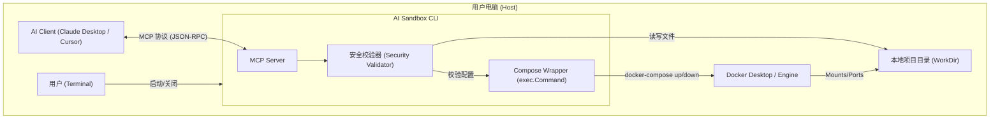

好的，基于我们刚刚达成的一致，这是完全重构后的 **v2.0 设计文档**。

这份文档将产品的核心逻辑从“管理平台”彻底转向了 **“AI 代理的本地执行终端”**。

---

# AI Coding Local Sandbox (CLI) 技术设计文档 v2.0

项目代号: ai-sandbox

版本: v2.0

日期: 2025 年 12 月

核心理念: Dumb Tool, Smart Agent (工具极简，智能在云)

## 1. 产品概述

### 1.1. 定位

这是一个本地运行的 CLI 工具（类似计算器），通过 MCP (Model Context Protocol) 协议连接 AI 模型（Claude/Cursor）。它不存储任何复杂状态，不管理用户系统，只做一件事：**安全地执行 AI 生成的 `docker-compose.yml` 配置，提供隔离的代码验证环境。**

### 1.2. 运行模式

- **随用随开**: 用户需要验证代码时在终端启动。
- **无状态**: 所有的环境定义都在当前目录的 `docker-compose.yml` 文件中。
- **一次性**: 验证完成，用户关闭工具或命令清理，环境即刻销毁（或保留供下次快速启动）。

## 2. 系统架构

架构极其扁平，单二进制文件（Golang）直接运行在用户宿主机上。

代码段



## 3. 核心功能定义 (MCP Tools)

本工具向 AI 暴露以下能力（Tools）。AI 将通过这些工具完成所有工作。

### 3.1. 文件系统能力 (FileSystem)

_权限限制：仅允许操作启动工具时指定的 `--workdir` 及其子目录。_

- **`fs_list_files`**:
  - **作用**: 递归列出当前目录下的文件结构。m
  - **用途**: AI "看" 项目结构，判断语言和依赖。

- **`fs_read_file`**:
  - **作用**: 读取指定文件内容。
  - **用途**: AI 读取代码内容或日志。

- **`fs_write_file`**:
  - **作用**: 写入或覆盖文件内容。
  - **用途**: **核心功能**。AI 用此工具编写代码、测试脚本，以及最重要的——**编写 `docker-compose.yml`**。

### 3.2. 容器编排能力 (Orchestration)

_底层实现：直接封装 `docker-compose` 命令行调用。_

- **`sandbox_compose_up`**:
  - **参数**: `background` (bool, default true), `recreate` (bool)
  - **逻辑**: 执行 `docker-compose up -d --build`。
  - **用途**: 启动验证环境。

- **`sandbox_compose_down`**:
  - **参数**: `clean_volumes` (bool)
  - **逻辑**: 执行 `docker-compose down`。如果 `clean_volumes=true`，则追加 `-v` 参数。
  - **用途**: 清理环境 / 重置环境 (Reset)。

- **`sandbox_compose_exec`**:
  - **参数**: `service` (string), `command` (string)
  - **逻辑**: 执行 `docker-compose exec -T [service] [command]`。
  - **用途**: 在容器内运行测试命令 (e.g., `pytest`, `npm test`)。

- **`sandbox_compose_logs`**:
  - **参数**: `service` (string), `tail` (int)
  - **用途**: 当启动失败或服务报错时，AI 获取调试信息。

## 4. 安全设计 (Security Model)

由于允许 AI 编写 Compose 文件，存在 AI 错误配置导致挂载敏感目录的风险。必须在工具层做“熔断”。

### 4.1. 路径校验 (Path Validation)

在执行 `sandbox_compose_up` **之前**，Go 程序必须解析生成的 `docker-compose.yml`，检查 `volumes` 字段。

- **规则**:
  1. 所有的 Host 路径必须是 **相对路径** (e.g., `./src:/app`)。
  2. 严禁出现绝对路径 (e.g., `/etc:/app` -> **DENY**)。
  3. 严禁出现父目录逃逸 (e.g., `../:/app` -> **DENY**)。
- **行为**: 如果校验失败，直接返回 Error 给 AI，拒绝启动 Docker。

### 4.2. 网络隔离 (可选 v2.1)

- 默认情况下，允许 Docker 使用 Bridge 网络访问外网（为了 `pip install` 等）。
- 未来可增加 `offline` 模式，禁止容器访问外部网络。

## 5. 交互流程脚本 (Workflow)

这是用户和 AI 的实际配合过程。

### 场景：用户想验证一个 Python Web 项目

1. **用户启动**:

   Bash

   ```
   cd ~/my-python-project
   ai-sandbox start
   # 输出: MCP Server running on stdio...
   ```

2. **AI 介入 (Claude Desktop)**:

   - AI 调用 `fs_list_files`，发现 `requirements.txt` 和 `main.py`。
   - AI 思考："这是一个 Python 项目，我需要配置环境。"

3. **AI 配置 (关键步骤)**:

   - AI 调用 `fs_write_file` 创建 `Dockerfile` (如果不存在):
     Dockerfile
     ```
     FROM python:3.9-slim
     WORKDIR /app
     COPY requirements.txt .
     RUN pip install -r requirements.txt
     ```
   - AI 调用 `fs_write_file` 创建 `docker-compose.yml`:
     YAML
     ```
     services:
       app:
         build: .
         volumes:
           - .:/app  # 挂载当前目录
         ports:
           - "8000:8000" # AI 根据代码判断出的端口
         command: tail -f /dev/null # 保持容器运行，等待 exec
     ```

4. **AI 启动与验证**:

   - AI 调用 `sandbox_compose_up`。
   - 工具通过安全校验，执行 Docker 命令。
   - AI 调用 `sandbox_compose_exec` 运行 `python -m pytest tests/`。
   - AI 读取返回结果，向用户报告："测试通过，且 8000 端口已映射，您可以访问..."。

5. **重置/退出**:

   - 用户："环境乱了，重来。"
   - AI 调用 `sandbox_compose_down(clean_volumes=true)`，然后重新 `up`。

## 6. 开发计划 (MVP Roadmap)

### 阶段一：骨架搭建 (Estimated: 2 Hours)

- 初始化 Go module。
- 引入 `github.com/mark3labs/mcp-go`。
- 实现基本的 CLI 入口 (`cobra` 或 `flag`)。

### 阶段二：Docker 封装 (Estimated: 3 Hours)

- 实现 `internal/docker` 包。
- 封装 `exec.Command("docker-compose", ...)`。
- 实现标准输出/错误流的捕获，以便回传给 AI。

### 阶段三：安全校验逻辑 (Estimated: 2 Hours)

- 引入 YAML 解析库 (`gopkg.in/yaml.v3`)。
- 实现 `ValidateComposeFile(path string) error` 函数，编写单元测试覆盖路径逃逸场景。

### 阶段四：AI 使用手册 (Prompt Engineering)

- 编写 `PROMPTS.md`，提供给用户复制给 AI。
- **Prompt 核心内容**:
  - "你是一个 DevOps 专家。"
  - "遇到新项目，先看文件，再写 docker-compose.yml。"
  - "总是把当前目录挂载到容器的 /app。"
  - "如果需要安装新库，直接运行 pip install，不要修改 Dockerfile 除非必要（为了速度）。"

## 7. 数据结构 (无数据库)

本系统 **没有数据库**。

- **配置**: 依赖 `docker-compose.yml`。
- **状态**: 依赖 Docker Daemon 自身的容器状态。
- **日志**: 依赖 Docker 自身的日志驱动。

---

这个 v2.0 文档完全贯彻了你的修改意见，是一个纯粹的、轻量级的本地工具。你如果觉得没问题，我们可以直接开始编写代码结构了。
